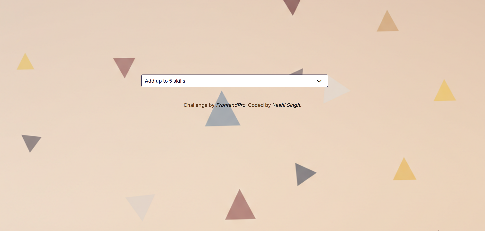

# Multi-Select Search Component

This is a Multi-Select Search Component built using HTML, JavaScript, and LESS. The component allows users to select up to five skills from a dropdown list and display them as tags with hover and remove functionalities.

## Features
- Fetches skills from a JSON file dynamically
- Allows selection of up to 5 skills
- Displays selected skills as removable tags
- Dropdown search functionality with filtering
- Stylish and interactive UI with hover effects

## Screenshot

**Desktop Design**


**Mobile Design**


## Installation

### Prerequisites
Ensure you have Node.js and npm installed on your system.

1. **Clone the repository:**
   ```sh
   git clone https://www.github.com/Yashi-Singh-9/Multi-Select-Search-Component.git
   cd Multi-Select-Search-Component
   ```

2. **Install dependencies:**
   The project uses LESS as a preprocessor. Install LESS globally using npm:
   ```sh
   npm install -g less
   ```

3. **Compile LESS to CSS:**
   ```sh
   lessc assets/styles/style.less assets/styles/style.css
   ```

## Running the Project
1. Open the `index.html` file in a browser.
2. Ensure that the `assets/js/skills.json` file is available for fetching the skills.
3. Select skills from the dropdown and see them added as tags.
4. Click on a tag to remove it.

## File Structure
```
.
├── assets
│   ├── images
│   │   ├── logo.svg
│   │   ├── background-image.png
│   ├── js
│   │   ├── script.js
│   │   ├── skills.json
│   ├── styles
│   │   ├── style.less
│   │   ├── style.css
├── index.html
├── README.md
```

## Technologies Used
- **HTML5**
- **JavaScript (ES6+)**
- **LESS (CSS Preprocessor)**
- **Font Awesome Icons**
- **Google Fonts (Inter)**

## Author
Coded by [Yashi Singh](https://www.linkedin.com/in/yashi-singh-b4143a246).

## Acknowledgments
Challenge provided by [FrontendPro](https://www.frontendpro.dev/frontend-coding-challenges).

## License
This project is open-source and available for use under the MIT License.